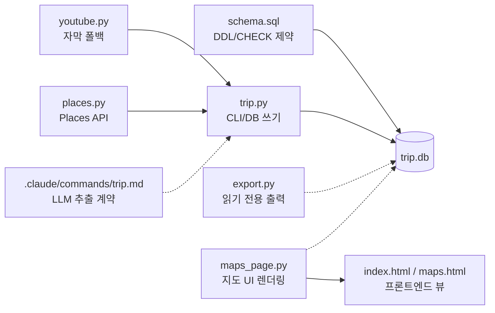

# CLAUDE.md — travel manager

여행 자료를 검증된 SQLite DB로 쌓는 CLI. 안티패턴 중심 가드레일.

> **새 세션이면 `HANDOFF.md` 를 먼저 읽어라.** 현재 진행 상황·다음 할 일·마감이 거기 있다.
> 여행은 **2026-09-21~24**. 남은 시간이 짧으니 새 기능보다 여행에 실제 쓰이는 것을 먼저 끝낸다.

## 절대 규칙

1. **LLM은 검색으로 retrieve 한 것만 쓴다.** 기억으로 지어낸 값은 쓰지 않는다.
   주소는 `/trip lookup`으로 웹 검색해서 **근거 URL과 함께** 저장한다.
   좌표·`place_id`는 검색으로 안 나오므로 **절대 쓰지 않는다** — 지어내면
   동선 최적화가 통째로 망가진다. `trip.py`가 거부한다.
   판정(`verify_status`)도 LLM이 하지 않는다. 코드가 도메인 수를 센다.
2. **원문을 요약해서 저장하지 않는다.** `source.raw_text`는 자막/본문 전문이다.
   추출이 틀렸을 때 재처리할 유일한 근거다.
3. **`verify`는 과금 단계다.** 자동 실행 금지. 사용자가 결정한다.
   기본 경로는 키가 필요 없는 `/trip lookup`이다.
4. **외부 패키지를 추가하지 않는다.** `youtube-transcript-api` 하나뿐이고
   나머지는 전부 stdlib다. `requests`·ORM·pydantic·pytest 금지.
5. **`git add .` 금지.** 자기가 고친 파일 경로만 명시해서 커밋한다.
6. **`.env`를 커밋하지 않는다.** `.gitignore`에 있다. `.env.example`만 커밋한다.
7. **작업 이력 동기화.** 코드 커밋(Push)이나 주요 변경사항 완료 후에는 반드시 `C:\Vault\Moon Life Planner\02. PARA\201. Projects\travel manager.md` 파일의 작업 이력 섹션에 내용을 업데이트해야 한다. (절대 잊지 말 것)

## 명령어

```bash
python test_trip.py                          # 테스트 (이게 전부)
python trip.py add                           # stdin JSON 저장
python trip.py import-takeout <csv>          # Takeout CSV 임포트
python trip.py pending --limit 20            # 주소 없는 장소 목록 (JSON)
python trip.py apply-lookup                  # 검색 결과 저장 (stdin JSON)
python trip.py verify --limit 50             # Places API 검증 (키 필요, 과금)
python trip.py list --status ambiguous       # 조회
python trip.py plan --day 3
python trip.py mark-saved 12 15              # 내 지도 저장 완료 표시
python export.py maps-links                  # 확인할 링크 목록
python export.py todoist-projects            # Todoist project_id 조회
python export.py todoist                     # 푸시 미리보기 (기본)
python export.py todoist --push              # 실제 푸시
```

## 구조



## 함정 (실제로 밟은 것)

- **Windows stdin이 cp949다.** 파이프로 들어온 UTF-8 한국어가 깨진다
  (`맛집` → `留쏆쭛`). `main()`의 `sys.stdin.reconfigure(encoding="utf-8")`를
  지우지 마라. `io.StringIO` 테스트로는 재현되지 않는다 —
  `test_cli_stdin_accepts_utf8_korean`이 subprocess로 잡는다.
- **stdout도 cp949다.** `—`·`✓`·이모지를 출력하면 `UnicodeEncodeError`로 죽는다.
- **Places field mask에 `rating`·`opening_hours`를 넣지 마라.** 구글은 field mask의
  가장 높은 등급으로 요청 전체를 과금한다. Pro(월 5,000 무료)가 Enterprise가 된다.
- **결과가 2건 이상이면 무조건 `ambiguous`.** 1순위를 자동 채택하면
  "이치란 나카스점"을 찾다가 "이치란 텐진점"이 확정된다.
- **웹 검색으로 `place_id`와 좌표는 안 나온다. 주소만 나온다.** 실측으로 확인했다.
  그래서 Claude 경로는 주소 기반 검색 링크를 쓴다 — 정확한 일본 주소는
  그 자체가 식별자라 한 곳으로 떨어진다.
- **Todoist REST v2(`/rest/v2/...`)는 폐기됐다. 410 Gone 을 낸다.** `/api/v1/...` 를 쓴다.
  v1 은 목록을 `{results, next_cursor}` 로 감싸므로 `unwrap()` 을 거쳐야 한다.
  `project_id` 는 `6hR986mmJqCrxHc4` 형태 문자열이고 브라우저 URL 의 대시 뒤와 같다.
- **Todoist 아이템은 `여행 중` 섹션의 `01. 살거`·`02. 먹을거`·`03. 놀거` 부모 밑에 넣는다.**
  `parent_id` 만 주면 섹션은 부모에서 상속된다. Todoist 가 제목을 `01\. 살거` 로
  이스케이프해 돌려주므로 `norm_content()` 로 벗기고 대조한다 — 안 그러면 부모를
  못 찾아 최상위(섹션없음)로 샌다. 실제로 62건이 샜다.
- **Todoist 프로젝트는 아내와 공유 중이고 이미 수십 건이 있다.** `export.py todoist` 는
  기본이 미리보기이고 실제 쓰기는 `--push` 를 요구한다. 이 기본값을 뒤집지 마라.
  중복 방지도 로컬 `todoist_task_id` 만으로는 부족해 원격 제목까지 대조한다.
- **Places API는 무료 한도만 써도 결제 수단 등록이 필수다.** 그래서 선택 경로다.
- **구글지도 저장 목록에 쓰는 API는 없다.** 링크를 만들어주고 사람이 클릭해서 저장한다.

## 문서

- 설계 스펙: `docs/superpowers/specs/2026-09-06-travel-manager-design.md`
- 구현 계획: `docs/superpowers/plans/2026-09-06-collect-to-db-core.md`

스펙과 코드가 다르면 스펙이 맞다. 코드를 고치거나 스펙을 갱신하고 이유를 남긴다.
